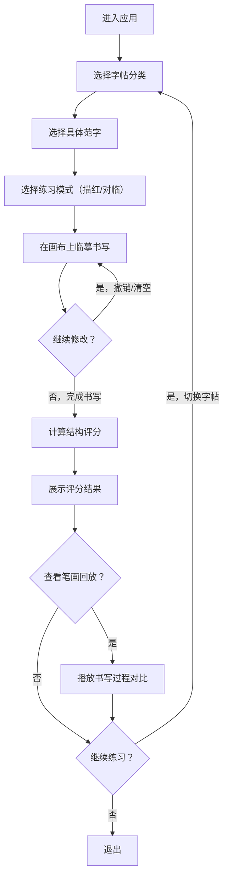

## 1. 产品概述

墨韵临帖是一款在线毛笔字临摹练习Web应用，用户可在屏幕上通过手指或鼠标临摹经典字帖，体验传统书法的魅力。应用模拟毛笔笔触的粗细变化和墨色浓淡，内置颜体、柳体等经典字帖，提供描红和对临两种练习模式，写完后智能评分帮助用户改进书写结构。

- 目标用户：书法爱好者、初学者、学生及任何想要练习毛笔字的人群
- 核心价值：降低传统毛笔练习门槛，随时随地进行书法练习，智能反馈提升学习效率

## 2. 核心功能

### 2.1 功能模块

1. **临摹画布**：核心书写区域，支持笔触模拟、半透明字帖叠加、撤销/清空、笔画回放
2. **字帖选择**：字帖库分类展示，从基本笔画到单字再到四字成语，按顺序解锁
3. **评分面板**：书写完成后展示结构评分、关键点对比、改进建议

### 2.2 页面详情

| 页面名称 | 模块名称 | 功能描述 |
|-----------|-------------|---------------------|
| 主练习页 | 临摹画布 | Canvas绘画，笔触粗细根据鼠标移动速度动态计算（慢则粗快则细），模拟飞白效果，范字半透明显示作背景 |
| 主练习页 | 字帖选择器 | 左侧分类列表（基本笔画/单字/四字成语），书体切换（颜体/柳体/欧体/赵体），练习模式切换（描红/对临） |
| 主练习页 | 评分面板 | 书写完成后弹出，显示总分、结构得分、笔画得分，关键点距离可视化对比，笔画回放功能 |
| 主练习页 | 工具栏 | 撤销、清空、完成评分、切换字帖、调整笔触粗细、显示/隐藏范字 |

## 3. 核心流程

用户进入应用后，首先选择字帖分类和具体范字，然后在临摹画布上进行书写练习。书写过程中，Canvas实时根据运笔速度模拟毛笔的粗细变化和飞白效果。用户可随时撤销或清空重写，完成书写后点击评分按钮，系统通过关键点距离算法计算结构准确度并展示评分结果，同时支持笔画回放与范字对比。用户可切换字帖继续练习，达成练习目标后解锁下一阶段内容。

## 4. 用户界面设计

### 4.1 设计风格

- **主色调**：宣纸米白 (#F5F0E6) 作为主背景，墨黑 (#2C2416) 作为主文字/笔触色，朱砂红 (#C23A2B) 作为印章/强调色
- **辅助色**：赭石 (#8B4513) 用于边框分隔，淡青灰 (#E8E4DC) 用于次要背景
- **按钮风格**：圆角矩形，轻微阴影，hover时有轻微上浮和颜色加深效果，主要按钮使用朱砂红配白色文字
- **字体**：标题使用书法风格字体（Ma Shan Zheng / ZCOOL XiaoWei），正文使用思源宋体（Noto Serif SC），营造典雅的中国传统美学氛围
- **布局风格**：三栏式布局，左侧字帖选择区，中间主画布区，右侧评分面板区；整体留白充足，层次分明
- **质感**：背景添加宣纸纹理效果，按钮和卡片使用柔和阴影模拟纸张厚度

### 4.2 页面设计概述

| 页面名称 | 模块名称 | UI元素 |
|-----------|-------------|-------------|
| 主练习页 | 字帖选择器 | 分类标签页（竖向排列）、字帖网格卡片（显示范字缩略图和书体）、锁定状态遮罩、当前选中高亮边框 |
| 主练习页 | 临摹画布 | 方形画布区域（米字格背景可选）、半透明范字水印、笔触实时绘制、工具栏浮动在画布上方 |
| 主练习页 | 评分面板 | 分数圆环展示、分项评分进度条、关键点热力图、回放控制按钮、改进建议列表 |
| 主练习页 | 工具栏 | 图标按钮组（撤销/清空/完成/切换模式/调整笔触）、当前字帖名称显示 |

### 4.3 响应式

- Desktop-first设计，三栏式布局
- 平板设备：字帖选择器折叠为侧边抽屉，评分面板可折叠
- 移动设备：单栏布局，画布占满屏幕，字帖选择和评分通过底部/顶部抽屉访问
- 触摸优化：画布区域支持触摸手势，按钮尺寸适合手指点击

