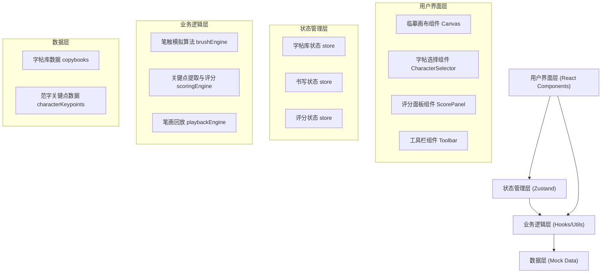

## 1. 架构设计



## 2. 技术描述

- **前端框架**：React@18 + TypeScript
- **构建工具**：Vite
- **样式方案**：Tailwind CSS@3
- **状态管理**：Zustand
- **图标库**：Lucide React
- **核心渲染**：HTML5 Canvas 2D API（无需额外图形库）
- **后端**：无，纯前端应用，所有数据使用Mock数据

## 3. 路由定义

| 路由 | 用途 |
|-------|---------|
| / | 主练习页面（唯一页面，SPA单页应用） |

## 4. 核心数据模型

### 4.1 字帖数据模型

```typescript
// 书体类型
type CalligraphyStyle = 'yan' | 'liu' | 'ou' | 'zhao'

// 字帖分类
type CopybookCategory = 'basic' | 'single' | 'phrase'

// 单个字帖
interface Copybook {
  id: string
  character: string           // 范字文字
  style: CalligraphyStyle      // 书体
  category: CopybookCategory   // 分类
  difficulty: number           // 难度 1-5
  order: number                // 解锁顺序
  unlocked: boolean            // 是否已解锁
  strokeCount: number          // 笔画数
  keypoints: Keypoint[]        // 结构关键点
  strokePaths: StrokePath[]    // 标准笔画路径（用于回放对比）
}

// 结构关键点
interface Keypoint {
  id: string
  name: string         // 关键点名称，如"起笔点"、"收笔点"
  x: number            // 相对坐标 0-1
  y: number            // 相对坐标 0-1
  importance: number   // 重要性权重 0-1
}

// 标准笔画路径
interface StrokePath {
  id: string
  order: number        // 笔画顺序
  points: PathPoint[]  // 路径点
}

// 路径点
interface PathPoint {
  x: number
  y: number
  pressure?: number    // 模拟压力
  timestamp: number
}
```

### 4.2 用户书写数据模型

```typescript
// 用户书写的一笔
interface UserStroke {
  id: string
  points: BrushPoint[]
}

// 笔触点（包含速度等信息）
interface BrushPoint {
  x: number
  y: number
  velocity: number     // 移动速度
  timestamp: number
}

// 书写会话
interface WritingSession {
  copybookId: string
  strokes: UserStroke[]
  startTime: number
  endTime?: number
}

// 评分结果
interface ScoreResult {
  totalScore: number          // 总分 0-100
  structureScore: number      // 结构分
  strokeScore: number         // 笔画分
  keypointComparisons: KeypointComparison[]
  strokeComparisons: StrokeComparison[]
  suggestions: string[]       // 改进建议
}

// 关键点对比
interface KeypointComparison {
  keypointId: string
  expected: { x: number; y: number }
  actual: { x: number; y: number }
  distance: number            // 归一化距离
  score: number               // 该点得分
}

// 笔画对比
interface StrokeComparison {
  strokeId: string
  similarity: number
  offset: { x: number; y: number }
}
```

## 5. 核心算法说明

### 5.1 笔触模拟算法
- 根据相邻两点间距离和时间差计算移动速度 velocity = distance / timeDelta
- 笔触宽度 = maxWidth - velocity * widthFactor，速度越慢笔触越粗
- 飞白效果：当速度超过阈值时，降低墨色不透明度（alpha值），并间歇性跳过部分像素绘制
- 使用二次贝塞尔曲线平滑相邻点，避免锯齿

### 5.2 结构评分算法
- 从用户书写轨迹中提取关键特征点（起笔、转折、收笔）
- 将用户关键点与范字关键点进行一一匹配（匈牙利算法或最近邻匹配）
- 计算每对匹配点的归一化欧氏距离
- 按关键点重要性加权平均得到结构分
- 笔画分基于笔画数量、书写顺序和路径相似度综合计算

### 5.3 笔画回放
- 记录每个笔触点的时间戳
- 按时间顺序逐帧重绘，重绘速度与原始书写速度保持一致
- 同时绘制范字标准路径作为对比，用不同颜色区分

## 6. 项目目录结构

```
src/
├── components/
│   ├── CopyCanvas/          # 临摹画布组件
│   │   ├── index.tsx
│   │   └── useBrush.ts      # 笔触模拟hook
│   ├── CharacterSelector/   # 字帖选择组件
│   │   └── index.tsx
│   ├── ScorePanel/          # 评分面板组件
│   │   └── index.tsx
│   ├── Toolbar/             # 工具栏组件
│   │   └── index.tsx
│   └── StrokePlayback/      # 笔画回放组件
│       └── index.tsx
├── store/
│   ├── copybookStore.ts     # 字帖库状态
│   ├── writingStore.ts      # 书写状态
│   └── scoreStore.ts        # 评分状态
├── utils/
│   ├── brushEngine.ts       # 笔触模拟算法
│   ├── scoringEngine.ts     # 评分算法
│   └── playbackEngine.ts    # 回放引擎
├── data/
│   └── copybooks.ts         # 字帖Mock数据
├── types/
│   └── index.ts             # 全局类型定义
├── App.tsx
├── main.tsx
└── index.css
```

